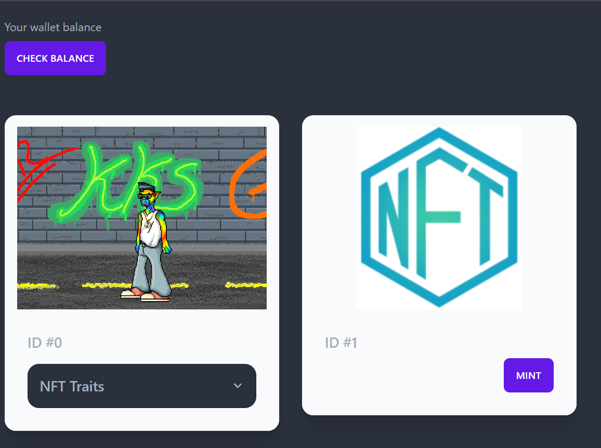
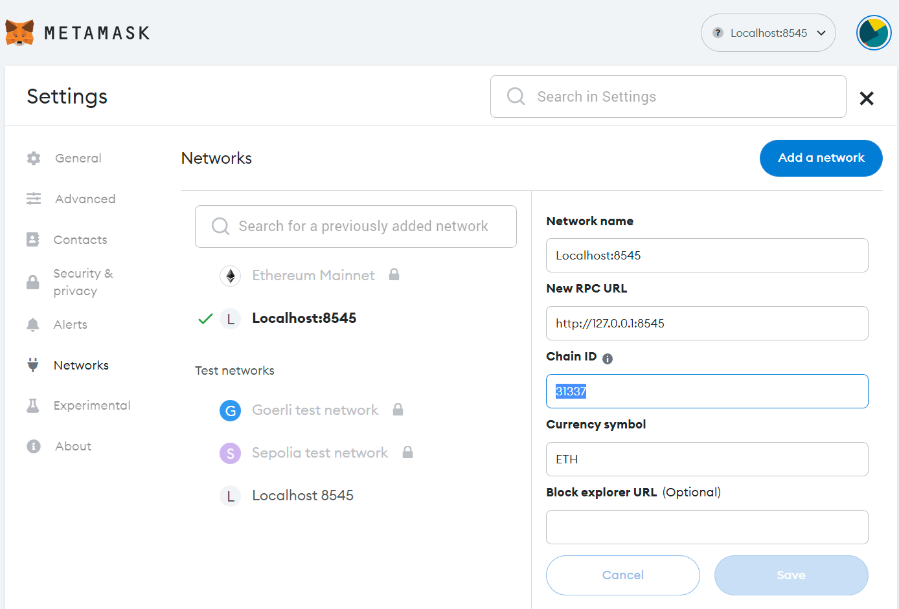
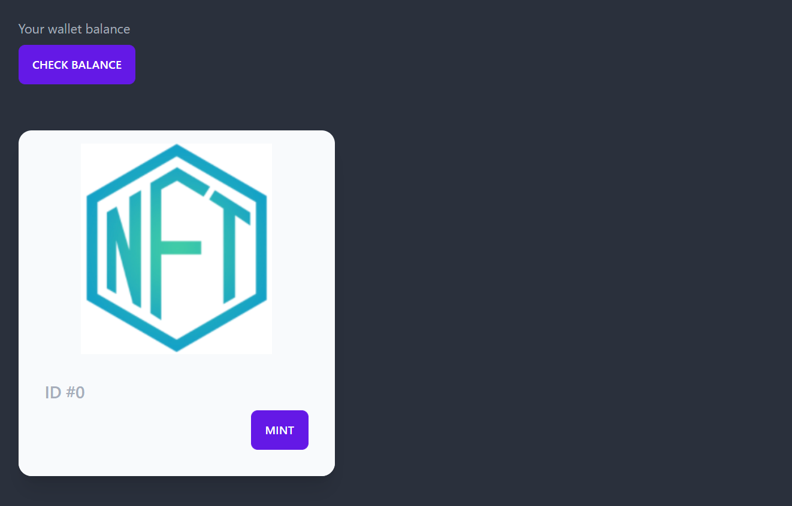
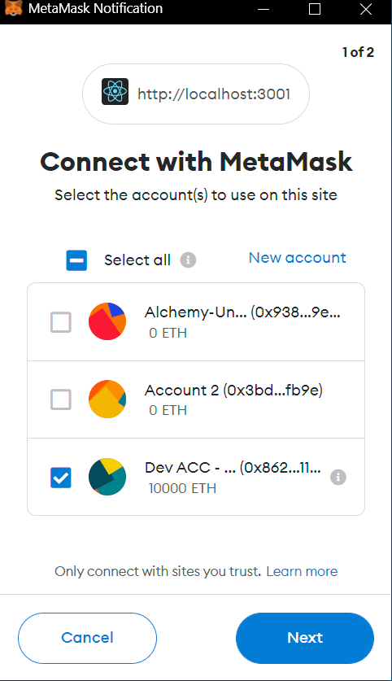
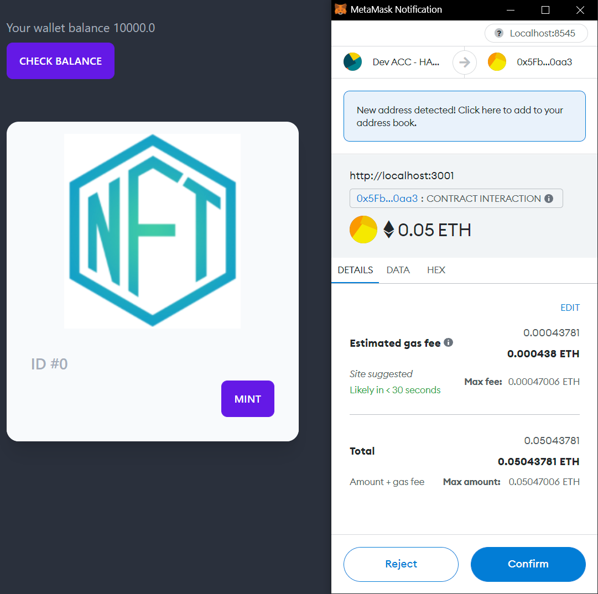

# NFT mint on Etherum

The aim for this project was to create an investment pot tracker that will allow users to make payments into their investment pots which there are 3 of. The following is a list of what the user can do:
* Users have 3 pots that they can put money into. They can select them from the hamburger icon in the top left

* Users are able to input the minimum of £50. A info toast is displayed if the user enters an amount lower than £50.

* After a successful submission there is a message stating how much was put in and to which pot.

* How much is remaining in the ISA allowance. If they have gone over their allowance.
There are also 3 quick add buttons for the amounts of 800, 1000 and 1200

* If the user enters the same amount into the input box twice and submits the amounts successfully then the last button amount "1200" will be updated with the amount entered twice.
* There is also a light/dark button on the top right. This changes the theme for the application.
<br />


## Technologies
* React 18.2.0
* Daisyui 2.31.0
* Tailwindcss 3.1.8
* Ethereum-waffle 3.4.4
* Ethers 5.7.2
* Hardhat 2.12.1

<br />
<br />

## Installation
First, run the development server:

```shell
npx hardhat node
npx hardhat compile
npx hardhat run scripts/deploy.js --network localhost
npm run start 
```

Open [http://localhost:3000](http://localhost:3000) with your browser to see the result.

The page will reload when you make changes.\
You may also see any lint errors in the console.
<br />
<br />

## Usage

First setup a localhost on your metamask and connect to it so it can talk to hardhat. Configuration below
<br />

<br />
Get an API from etherscan and enter it into the hardhat.config.js
<br />
<br />
Connect your wallet to the app by clicking the check balance button.
<br />

<br />

<br />
<br />
Next click the mint button to get an NFT
<br />

<br />
<br />
Your NFT will be displayed in the app. You can refresh the page to get another one.


## Issues 
If you get an error message about a nonce being too high please follow the instructions in the article below:
https://medium.com/@thelasthash/solved-nonce-too-high-error-with-metamask-and-hardhat-adc66f092cd#:~:text=Open%20up%20your%20MetaMask%20window,appear%20when%20you%20make%20transactions.